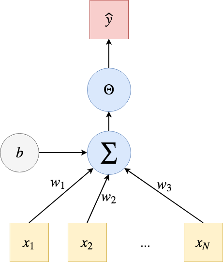
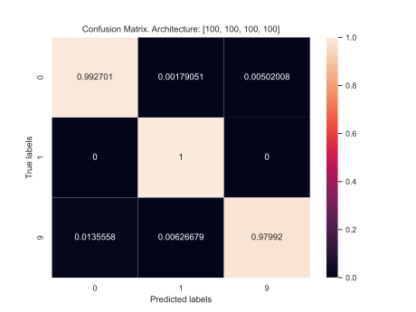

<div class="row" style="width:100%;margin-top:200px">
  <h1 class="almost_white">Comparing Neural Networks via Generalized Persistence</h1>
  <h3 class="almost_white">Mattia Bergomi & Pietro Vertechi </h3>
  <h4 class="almost_white">{mattia.bergomi, pietro.vertechi}@veos.digital</h4>
</div>
<div class="row" style="width:100%">
  <div class="column" style="width:100%;margin-left:50%">
    
  </div>
</div>

---

layout: true
<div class="footer">
  
</div>

---

### Table of contents

- Introduction

  - Team
  - Motivations
  - Aims

--

- Rank-based and multicolored persistence (sketches)
See [P. Vertechi, and M. G. Bergomi, Rank-based persistence. 2020.](http://www.tac.mta.ca/tac/volumes/35/9/35-09.pdf) for details.

  - Ranked categories
  - Categorical persistence functions
  - Examples:
      - Labelled point clouds
      - Manifold with group action

--

- Applications
  
  - Data-representation flow in neural networks
  - Neural architecture comparison
  - Hidden states inference in Reinforcement Learning

---

### Team


---

### Motivations

.column-right.long[
  
]

.column-left[
  Many applications deal with data that do not naturally live in the category of
  topological spaces (finite simplicial complexes).]


.column-left[
  A variety of clever constructions allow for mapping data to suitable
  categories for persistence.

]


.column-left[
  Which kind of information is forgotten (or added), when building auxiliary
  simplicial complexes?
]

---

count: false

### Motivations

.column-right[
  
]

.column-left[
  Many applications deal with data that do not naturally live in the category of
  topological spaces (finite simplicial complexes).]


.column-left[
  A variety of clever constructions allow for mapping data to suitable
  categories for persistence.

]


.column-left[
  Which kind of information is forgotten (or added), when building auxiliary
  simplicial complexes?
]

---

### Aims

.column-left[
  Develop a framework where other categories than $(\mathbf{Top}, \mathbf{Vec})$
  and other functors than homology can yield persistence (diagrams) endowed
  with the usual properties.
]

--

.column-right.long[


]

--

.column-left[

#### Incomplete state of the art

- [F. Chazal, D. Cohen-Steiner, M. Glisse, L. J. Guibas, and S. Y. Oudot. Proximity of persistence modules and their diagrams. 2009.]()
- [P. Bubenik and J. A. Scott. Categorification of Persistent Homology. 2014.]()
- [S. Oudot. Persistence Theory: From Quiver Representations to Data Analysis. 2015.]()
- [F. Chazal, V. de Silva, M. Glisse, and S. Oudot. The Structure and Stability of Persistence Modules. 2016.]()
- [A. McCleary and A. Patel. Bottleneck Stability for Generalized Persistence Diagrams. 2020.]()

]

---

### The fundamental ingredients of persistence


Persistent homology requires a few basic ingredients:
- A filtration $X\_t$ in the category $\mathbf{Top}$.

--

- A functor $H\_k:\mathbf{Top} \to \mathbf{FinVec}$ (the homology in some degree).

--

- A measure of rank in the category $\mathbf{FinVec}$ (the dimension of the vector space).

--

### The recipe

- Start with a filtration of topological spaces $X\_t$.

- Obtain vector spaces $H\_k(X\_t)$ with linear maps $H\_k(X\_s) \to H\_k(X\_t)$ for $s \le t$.

- Consider the persistent homology spaces $im(H\_k(X\_s) \to H\_k(X\_t))$.

- Compute the the persistent Betti numbers $dim(im(H\_k(X\_s) \to H\_k(X\_t))$.

---

### Rank function generalizes dimension of vector spaces and cardinality of sets

--

.column-right[
 
  Regular categories ($\mathbf{Set}$, $\mathbf{Group}$, $\textbf{Mod}_R$,
  $\mathbf{Ring}$) allow us to define naturally a notion of image.

  Let $X, Y$ be sets, and $f:X\rightarrow Y$. $f$ factors as
  
  $$X↠ \lbrace y\in Y \;|\; \exists x\in X:\; f(x)=y \rbrace ↪ Y$$
]

--

.column-left[
Let us take a regular category $\mathbf R$ and a function $r: \textnormal{Obj}(\mathbf R) \to \mathbb Z$. We say that $r$ is a rank function if:

- for any monomorphism $A \hookrightarrow B$, $r(A) \le r(B)$

- for any regular epimorphism $A \twoheadrightarrow C$, $r(A) \ge r(C)$

- given a pullback square:

the following inequality holds

$$r(B) - r(D) \ge r(A) - r(C)$$
]

---

### Explaining the pullback condition

.column-right[

  
]

.column-left[

- If we restrict a surjection, the excess of the domain over the codomain is reduced.

- Always true if the excess is the sum of the excesses along the fibers: in that case we say the rank is fiber-wise.
]

--

.column-left[
- Cardinality in $\mathbf{FinSet}$

- Dimension in $\mathbf{FinVec}\_\mathbb{K}$

- In an Abelian category, length of composition series of an object:
$$0 \simeq X\_0 \hookrightarrow X\_1 \hookrightarrow \dots \hookrightarrow X\_n \simeq A$$ where all $X\_{i+1}/X\_i$ are simple.

- Any non-negative "exact" function in an Abelian category, i.e. such that $r(0) = 0$ and for all short exact sequence $X \to Y \to Z$, $r(Y) = r(X) + r(Z)$
]

--

.column-right[
  The category $\textbf{Mod}_R$ of modules on a ring is Abelian.

  - Zero object: $0$-module (the trivial group equipped with the trivial $R$ action).
  - Let $f: N_1\rightarrow N_2$, then $ker(f) =\lbrace x \;|\; f(x)=0\rbrace$, and $coker(f)=N_2/Im(f)$.
  - A homomorphism $f: N_1\rightarrow N_2$ is a monomorphism (epimorphism)
  only if it is an injection (surjection).

| Like $\mathbf{Vec}$ |  Unlike $\mathbf{Vec}$ |
|---|---|
| Length as a notion of dimension | No notion of basis |
]

---

### Categorical persistence function

.column-left[
__Properties of persistent Betti numbers__

Given $u\_1\le u\_2 \le v\_1 \le v\_2$:
- $p(u\_1, v\_1) \le p(u\_2, v\_1)$ and $p(u\_2, v\_2) \le p(u\_2, v\_1)$

- $p(u\_2, v\_1) - p(u\_1, v\_1) \ge p(u\_2, v\_2) - p(u\_1, v\_2)$
]

--

.column-left[
__Definition__ (Categorical persistence function).
$p:\textnormal{Morph}(\mathbf C) \to \mathbb Z$ such that, given $u\_1\to u\_2 \to v\_1 \to v\_2$:
- $p(u\_1 \to v\_1) \le p(u\_2 \to v\_1)$ and $p(u\_2 \to v\_2) \le p(u\_2 \to v\_1)$

- $p(u\_2 \to v\_1) - p(u\_1 \to v\_1) \ge p(u\_2 \to v\_2) - p(u\_1 \to v\_2)$

We recover the original definition when $\mathbf C = (\mathbb R, \le)$.
]

---

### Categorical persistence function

.column-left[
**From a rank**

Given a rank $r:\textnormal{Obj}(\mathbf C) \to \mathbb Z$, the rank of the image of a morphism $\phi \mapsto r(im(\phi))$ is a categorical persistence function:
- cardinality of the image of a function between sets.
- rank of a morphism between vector spaces.
- length of the image of a morphism in an Abelian category.
]

--

.column-right.long[

]

.column-left[
**From another categorical persistence function**

Given a categorical persistence function $p$ in $\mathbf D$ and a functor $F:\mathbf C \to \mathbf D$, $p\circ F$ is a categorical persistence function in $\mathbf C$:
- $H\_k: \mathbf{FinSimp} \to \mathbf{FinVec}$ defines a persistence function in $\mathbf{FinSimp}$.
- $Blocks: \mathbf{FinGraph}_{monic} \to \mathbf{FinSet}$ defines a persistence function in $\mathbf{FinGraph}$.
]

---

### Summary

.column-left[
A categorical persistence function $p:\textnormal{Morph}(\mathbf C) \to \mathbb Z$ and a functor $F: (\mathbb R, \le) \to \mathbf C$ induce a categorical persistence function on $(\mathbb R, \le)$, i.e., the classical case.

We also retrieve the known fact that functors $(\mathbb R, \le) \to \mathbf C$, i.e. $(\mathbb R, \le)$-indexed diagrams in $\mathbf C$, generalize filtrations: inclusion maps are no longer required to be monomorphisms.
]

--

.column-right.long[

]

.column-left[
<div style="display: block; height:2rem"></div>

<center>
<table>
<thead>
<tr>
    <th>Classical framework</th>
    <th>Categorical framework</th>
</tr>
</thead>
<tbody>
<tr>
    <td>Topological spaces</td>
    <td>Source category $\mathbf C$</td>
</tr>
<tr>
    <td>Vector spaces</td>
    <td>Regular target category $\mathbf R$</td>
</tr>
<tr>
    <td>Dimension</td>
    <td>Rank function on $\mathbf R$</td>
</tr>
<tr>
    <td>Homology functor</td>
    <td>Arbitrary functor $\mathbf C \to \mathbf R$</td>
</tr>
<tr>
    <td>Filtration of topological spaces</td>
    <td>$(\mathbb R, \le)$-indexed diagram in $\mathbf C$</td>
</tr>
</tbody>
</table>
</center>
]

---

### Persistence diagram

.column-left[
Let $p:\textnormal{Morph}(\mathbf{C})\to \mathbb Z$ be a persistent function, and $F:(\mathbb R, \le) \to \mathbf{C}$ a functor. We can define:

\\[ p\_F: \Delta^+ \to \mathbb Z \\]
\\[ (u, v) \mapsto p(F(u \le v)) \\]
]

<!-- --
.column-right.long[]

.column-left[
**Definition** Given $p\_F$ as above, we can define the cornerpoint multiplicity of $u < v$ as:
$$ \mu(u, v) = \min p\_F(\beta, \gamma)-p\_F(\alpha, \gamma) - p\_F(\beta, \delta)+p\_F(\alpha, \delta)$$

where the minimum is taken over $\alpha, \beta, \gamma, \delta$ respecting $\alpha < u < \beta$ and $\gamma < v < \delta$.
] -->

<!-- --

.column-right[
**Remark** More generally, $p\_F(\beta, \gamma)-p\_F(\alpha, \gamma) - p\_F(\beta, \delta)+p\_F(\alpha, \delta)$ denotes the sum of multiplicities of cornerpoints inside the rectangle $(\alpha, \beta] \times (\gamma, \delta]$ (technical assumption: $\alpha, \beta, \gamma, \delta$ must be right-regular).
] -->

--

.column-right.long[

]

.column-left[
**Definition** We denote $\mathcal{D}F$ the persistence diagram of $F$ (cornerpoints with multiplicity).
]
---

### Persistence diagram for semisimple categories

<div class="row">
  <div class="column" style="width:30%">
    </img>
  </div>
</div>

---
count: false
### Persistence diagram for semisimple categories

<div class="row">
  <div class="column" style="width:30%">
    </img>
  </div>
  <div class="column" style="width:55%; float: right">
    <p>
      For semisimple Abelian categories with rank function $length$, the persistence diagram
      is informative about the decomposition of a tame $(\mathbb R, \le)$-indexed diagram.
    </p>
    <p>
      In $\mathbf{R}^{(\mathbb R, \le)}$ we have "interval objects" of the type:
      <div style="display: flex; flex-direction: row; justify-content: space-around">
        $$
        \chi_{I, S}(a)  = \begin{cases}{}
            S&\text{if } a \in I\\
            0 &\text{otherwise}
        \end{cases}
        $$

        $$
        \chi_{I, S}(a \le b) = \begin{cases}{}
            \textnormal{Id}_S&\text{if } a, b \in I\\
            0 &\text{otherwise}
        \end{cases}
        $$
      </div>
      for $I$ an interval and $S$ a simple object of $\mathbf{R}$.
    </p>
    <ul>
      <li>Tame $(\mathbb R, \le)$-indexed diagram are finite sums of interval objects.</li>
      <li>The interval extrema, with multiplicity, are given by the persistence diagram.</li>
    </ul>
  </div>
</div>

---

<!-- ---

### Interleaving and bottleneck distances


--- -->

### Interleaving and bottleneck distances

.column-right[
Interleaving and bottleneck distance can be defined as in the classical theory.

Bottleneck distance is defined in terms of persistence diagrams, as the infimum $l\_\infty$ distance of bijections of $\mathcal{D}F$ and $\mathcal{D}G$


**Definition** Two functors $F, G:(\mathbb R, \le) \to \mathbf{C}$ are $\epsilon$-interleaved if there are natural transformations
$$F\to GT\_\epsilon$$
$$G\to FT\_\epsilon$$

where $T\_\epsilon$ is the translation functor $x \mapsto x+\epsilon$, such that the following diagrams commute


The interleaving distance is the infimum of $\epsilon$ values such that $F$ and $G$ are $\epsilon$-interleaved.

]

--

.column-left[
**Theorem** (Stability) Given a category $\mathbf{C}$ with finite colimits, a persistence function $p$ on $\mathbf{C}$ and two tame $(\mathbb R,\le)$-indexed diagrams $F, G:(\mathbb R, \le) \to \mathbf{C}$, the interleaving distance between $F,G$ is greater or equal than the bottleneck distance:

$$d\_\mathbf{C}(F, G) \ge d(\mathcal{D}F, \mathcal{D}G)$$
]

--

.column-left[
**Theorem** (Tightness) Given a semisimple Abelian category $\mathbf{R}$ with essentially one simple object and the persistence function $\phi \mapsto length(im(\phi))$, interleaving and bottleneck distances are equal on tame $(\mathbb R, \le)$-indexed diagrams.

**Remark** Theorem (Tightness) generalizes the classical result on $\mathbf{R}=\mathbf{FinVec}\_\mathbb{K}$. We need the hypothesis "essentially one simple object", as two constant filtrations of non-isomorphic simple objects would have infinite interleaving distance and bottleneck distance equal to $0$.
]

---

### Multicolored persistence

.column-left[
Bottleneck distance is not very informative in categories with many non-isomorphic simple objects. We can refine it by coloring the persistence diagram.

Given a ranked category $(\mathbf{R}, r)$ (i.e. $\mathbf{R}$ is regular and $r$ is a rank function) and a family of ranked categories $(\mathbf{R}\_\gamma, r\_\gamma)$,  a coloring is a family of functors $\mathcal{C}\_\gamma:\mathbf{R}\to \mathbf{R}\_\gamma$ such that:

- The natural map 
  $$\textnormal{Hom}\_\mathbf{R}(X, Y) \to \prod\_{\gamma} \textnormal{Hom}\_{\mathbf{R}\_\gamma}(\mathcal{C}\_\gamma(X), \mathcal{C}\_\gamma(Y))$$
  is bijective.

- The rank function $r$ is the sum of its components: $r(X) = \sum\_\gamma r\_\gamma(\mathcal{C}\_\gamma(X))$
]

--

.column-right[
  
  **Remark:** The same notion can be recovered in a different flavor from the framework developed in
  [A. McCleary and A. Patel. Bottleneck Stability for Generalized Persistence Diagrams. 2020]().

]

---

### Examples

.column-left[
  **Labelled point cloud**

  
  
  
  
  
  
  


]

--

.column-right[

  **Group action**

  
  
  
]

--

.column-right[

  The multicolored persistence diagram is simply the sum of persistence
  diagrams of the components superimposed in different "colors".
]

<!-- ### Same story in a different flavor

Our framework meshes well with a recent generalization of persistent homology
presented in
[A. McCleary and A. Patel. Bottleneck Stability for Generalized Persistence Diagrams. 2020]().

Where we investigate arbitrary integer-valued functions that obey a set of
axioms, McCleary and Patel's framework considers a specific function valued in a
potentially different group, the Grothendieck group of an Abelian category. 

Applications of the two approaches are closely related (the notion
introduced in [20] recovers the multicolored bottleneck distance in semisimple Abelian
categories): it will be interesting to explore whether there exists a common generalization
of both approaches, based on axiomatizing rank functions valued in arbitrary Abelian
groups. -->

---

### Take-home messages

.column-left[
- Categorical persistence is a general framework to work with objects indexed
    by a real parameter.
- Persistence diagram, bottleneck and interleaving distances, and stability
  inequalities hold in a very general setting.

- Multicolored persistence refines classical persistence when the target category
  has many distinct simple objects (e.g. category of group representations).

More details at [P. Vertechi, and M. G. Bergomi, Rank-based persistence. 2020.](http://www.tac.mta.ca/tac/volumes/35/9/35-09.pdf)
]


---

### Applications
#### Deep learning - sketches

.column-right[
  

  <small>Image credits: Francesco Cicala</small>
]

---

### Applications
#### Deep learning - sketches

.column-left[
- The XOR problem was solved by *stacking* perceptrons.

- *Multilayer perceptrons* with sufficiently many *hidden neurons* are universal function approximators.
]

.column-right[
  

  <small>Gong and Murayama - 2016</small>
]

---

### Applications
#### Aim

.column-left[
- In modern machine learning, the multilayer perceptron has been replaced by complex, hand-crafted architectures.

- We take advantage of multicolored persistence to describe:
  - the data representation obtained by passing through a neural architecture;
  - the evolution of labelled data throughout the architecture;
  - compare neural architectures.
]

--

.column-right[


<small>Vaswani et al., 2017</small>
]

---

### Applications - Multicolored persistence
#### Algorithm and software interface

.column-left[

1. Select a dataset;
2. Define a model (MLP, hidden layers, loss, optimizer);
3. Train the model;
4. Evaluate the model on the test set;
5. Retrieve the dataset as embedded in layer $n$, 
$$E\_n = \lbrace (e\_{n,1}, l\_1), \dots, (e\_{n,m}, l\_m) \rbrace\subset\mathbb{R}^n;$$
6. Compute the Vietoris-Rips complexes associated to the labelled point cloud $E_n$;
7. Build the multicolored persistence diagram.

]

--

.column-right.long[
  
]

---

count:false

### Applications - Multicolored persistence
#### Algorithm and software interface

.column-right.long[
  
]

.column-left[
```python
# data configuration
dataset_name, batch_size = "MNIST", 128
data_folder, ckpt_folder = "./data", './checkpoints'
classes = [2, 3, 8]
```
]

--

.column-left[
```python
# model configuration
model_class, hidden_size = FC, [128, 256]
act, last_act = "relu", "log_softmax"
```
]

--

.column-left[
```python
# TDA configuration
vr_distance, max_dimension, min_persistence = 3, 2, 0
```
]
--

.column-left[
```python
... = load_dataset(dataset_name, ...)
... = get_trained_model(model_class, ...)
... = get_best_model_and_stats(...)
... = get_diagrams(..., vr_distance, max_dimension)
... = select_cornerpoints(dgms[deg], ...)
```
]


---

### Applications - Multicolored persistence

.column-left[
  **Architecture**:

 

 We aim to represent as persistence diagrams the embeddings generated at each 
 layer of the trained architecture considering $H_1(VR(E_i))$.

]

--

.column-right[

  
]

---

### Applications - Multicolored persistence

.column-left[
  **Architecture**:

 

 We can also compare embedding generated by considering different label subsets
 $\lbrace C\_i\rbrace\_{i\in I}$, considering $H\_1(VR(E\_{last, k}))$ for $k\in I$.

]

--

.column-right[
  
]
---

### Applications - Multicolored persistence

.column-left[
  The software interface described above makes it possible to compare multiple 
  architectures and label subsets.

  **Architectures:**
  
  $\lbrace (100), (100,100), (100,100,100), (100,100,100, 100)\rbrace$
  
  **Label subsets:**

  $\lbrace (2, 3, 8), (0, 1, 9), (0, 2, 6, 8) \rbrace$

  **Parameters:**

  - Optimizer: Stochastic gradient descent
  - Learning rate: 0.005
  - Training epochs: 20
  - Vietoris-Rips maximum distance: 3

**Outputs:**
Each configuration (i.e., model, classes, embedding index, and trainig and TDA
parameters) generates the following outputs:

1. Loadable trained model, and test stats;
2. Dimensionality reduction of the embedding of choice;
3. Persistence diagrams in a given degree.
]

--

.column-right[

  
  

  
  
]

---

### Applications - Multicolored persistence

<!-- Comparing architectures: -->

.column-left[


]

--

.column-right[


]

---

### Applications - Multicolored persistence

.column-left[
#### Multicolored bottleneck distance

| Label | Distance |
|---|---|
|0, 2| 0.14081764221191406|
|0, 2, 6| 0.16994667053222656|
|2, 6| 0.2582348585128784|
|0, 2, 8| 0.2588844299316406|
|2, 6, 8| 0.33828920125961304|
|0, 6| 0.34149169921875|
|6, 8| 0.3416602611541748|
|2, 8| 0.595687747001648|

$d\_{B\_\gamma} =  0.5956$
]

.column-left[


]

---

### Applications - Multicolored persistence

#### Cluster neural architectures

.column-left[

]

--

.column-right[
These applications are partially described in 
[M. G. Bergomi, P. Vertechi. Comparing Neural Networks via Generalized Persistence. 2020.](https://www.researchgate.net/publication/354177305_Comparing_Neural_Networks_via_Generalized_Persistence)
]

---

### Applications - Blocks

#### State inference 

.column-left[

]

--

.column-right[
  
]

---

count: false

### Applications - Blocks

#### State inference 

.column-left[

]

.column-right[
  
]

--

.column-right[
  
]

---

count: false

### Applications - Blocks

#### State inference 

.column-left.long[

]

.column-right[
  
]

.column-right[
  
]

--

.column-right[
  
]

---

count: false

### Applications - Blocks

#### State inference 

.column-left.long[


]

.column-right[
  
]

.column-right[
  
]

.column-right[
  
]

---

layout: false
class: center


{pietro.vertechi, mattia.bergomi}@veos.digital
