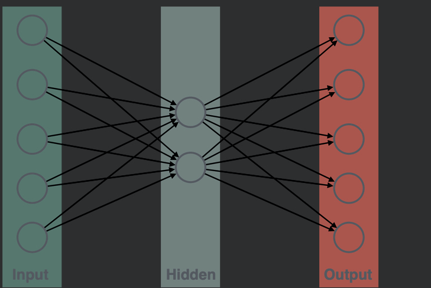
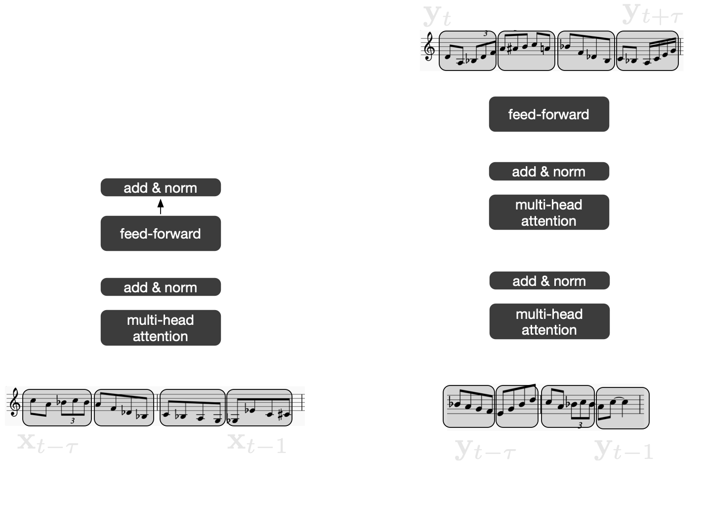
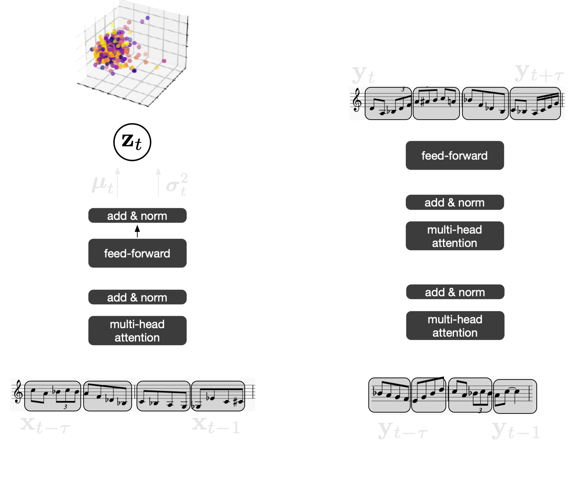

<div class="row" style="width:100%;margin-top:200px">
  <h1 class="almost_white">A composer's Digital Twin</h1>
  <h3 class="almost_white">Axel Chemla-Romeu-Santos, Mattia G. Bergomi, Emmanuel Deruty & Stefan Lattner</h3>
  <p class="almost_white">{axel.chemla, mattia.bergomi}@veos.digital, derutycsl@gmail.com, me@stefanlattner.at</p>
</div>
<div class="row" style="width:100%">
  <div class="column" style="width:100%;margin-left:50%">
    
  </div>
</div>

---

layout: true
<div class="footer">
  
</div>

---
### Team


---

### Table of contents

- Introduction

  - Deep learning (in music) - sketch
  - Problem
  - Aims

--

- Data flow
  - Acquisition
  - Data Augmentation
  - From constrained to model-free segmentation

--

- Model
  - Motivation
  - Architecture
  - Results

---

### Deep learning sketch

--


---

### Deep learning sketch


---

### Deep learning (in music) sketch


--


<!-- TODO (Axel): This is a silly state of the art. Probably we can do better here -->

---

### Problem

.column-left[
  By its own very nature, music is a complex object, whose features, even from 
  an abstract viewpoint, cannot be organized naturally as independent entities.
]

.column-right[
  
]

--

.column-left[
  There is yet no objective way to determine the goodness of a composition.
  Moreover, deep learning models often require vast datasets to learn stable, 
  generalizable features.
]

--

.column-left[
  Compositional and performative aspects are treated separately.
]

---

### State of the art


---

### Aims

.column-left[
Design and implement a machine learning model trainable on a relatively small 
amount data taken from a single player’s set of recordings. 

We aim to 
1. grasp the main characteristics of the compositional and playing style of a musician as medium-term generations;
2. provide a controllable and visualizable representation of the space of extrapolated phrasings;
3. allow for real-time interactive performances.
]

--

.column-right[
  
]

---

### Data flow

.column-left[
  #### Acquisition 

The dataset CDT-1 has been realized in collaboration with Gabriele Bulfon.

- 8 original compositions,
- each with a predetermined, annotated structure.
- 3 takes (~5 minutes each) per composition, recorded a tempo. BPM can vary across takes.


]

.column-right[
  
  http://www.gabrielebulfon.com/
]

--

.column-left[<audio src="assets/Sony5-take3-80bpm.mp3" type="audio/mpeg" controls preload></audio>

```
>> intro
01.1 Amaj13
02.1 Dmaj#11/A
03.1 Amaj13
04.1 Dmaj#11/A
```
]

---

### Data flow

.column-left[
  #### Ground truth 

  Charlie Parker Omnibook XML data

  - 50 themes and improvisations from the Omnibook 
 
<small>Ken Deguernel, Emmanuel Vincent, and Gerard Assayag. SMC 2016.</small>
]

---

### Data flow


  


---

### Augmentation

.column-left[
- **Transposition**: transpose the incoming (meta)data by adding random pitch offsets.
  
- **Stylistic injection**: we leverage the topology of low-dimensional embeddings to identify style-compatible patterns to augment a given datasets with exogenous samples.
  
- **Tonnetz transposition**: augmentation through common tonal substitutions (e.g. major to minor triads) can be achieved with classical transformation on the Tonnetz.
]

.column-left[
  
]

---

### From constrained to model-free segmentation

.column-left[
  The ability to decipher and isolate relevant musical concepts is key for 
  mid- and long-term music generation.

  Offline models can rely on segmentation based on common descriptors 
  (e.g, bars, beat, and downbeat).

  However, moving towards real-time interactions requires the development of
  model-free segmentation algorithm
]

.column-right[
  
]

--

.column-right[
  
]

--

.column-right[
  
]

---

### From constrained to model-free segmentation


---

### From constrained to model-free segmentation

.column-left[
Latent 0
<audio src="assets/latent_0.mp3" type="audio/mpeg" controls preload></audio>

Latent 1
<audio src="assets/latent_1.mp3" type="audio/mpeg" controls preload></audio>

Latent 2
<audio src="assets/latent_2.mp3" type="audio/mpeg" controls preload></audio>

Latent 3
<audio src="assets/latent_3.mp3" type="audio/mpeg" controls preload></audio>
]

.column-right[
  
]

---

### Model

.column-right[
  
]

.column-left[
  The *Transformer* architecture allows to translate a given _input_ sequence with an auto-regressive mechanism, enforcing the temporal consistency of the generated sequence. 
]

--

.column-left[
  The Transformer is based on _multi-head attention_ mechanisms, significantly improving the model ability to handle long-term dependencies.

  <small>Vaswani, Ashish, et al. "Attention is all you need." arXiv preprint arXiv:1706.03762 (2017)</small>
 ]


---

### Model

.column-right[
  
]

.column-left[
We transpose this sequence translation paradigm to co-improvisation setups, where the input sequence is the music played by the pianist. We also condition the transformer on the past input sequences, in order to make the model usable in real time. 
]

--

.column-left[
The generation of the model is thus _influenced_ by the notes played by the pianist, while its temporal consistency is ensured by the auto-regressive constraint.
]

---

### Model

.column-left[
  We add a compressed stochastic representation at the top of the encoder in order to allow the model to generate different outputs from a single input, hence providing a space of latent continuations that can be used for interaction. 
]

.column-right[
  
]

---

### Results 

.column-left[
- Target: 

<audio src="assets/Target_1.mp3" type="audio/mpeg" controls preload></audio>


- Input: 

<audio src="assets/Inputs5_8.mp3" type="audio/mpeg" controls preload></audio>


- Generation: 

<audio src="assets/Gen5_8.mp3" type="audio/mpeg" controls preload></audio>
]

--

.column-right[
- Input: 

<audio src="assets/Input5_13.mp3" type="audio/mpeg" controls preload></audio>

- Generation: 

<audio src="assets/Gen5_13.mp3" type="audio/mpeg" controls preload></audio>
]

---

### Take-home messages

.column-left[
- Musical symbols' segmentation can be learned via Variational Auto-encoding

- A transformer-based model can learn from small datasets some of the characteristic of the compositional and performance style of a given composer.

- It is possible to design deep learning models suitable for real-time interaction.
]

---

### What's next

.column-left[
- Validation on real-time Composer/Model interaction during performances.
  
- Cross-dataset robustness.

- Test naive and topology-based style transfer. <small>Work in progress based on Vertechi, & Bergomi, M. G. (2020). Comparing Neural Networks via Generalized Persistence. SIS 2020</small>.

- Beyond discrete transformers with 
<small>Vertechi, & Bergomi, M. G. (2020). Parametric machines: a fresh approach to architecture search. arXiv preprint arXiv:2007.02777.</small>.
]


---

layout: false
class: center


{axel.chemla, mattia.bergomi}@veos.digital
