

  <h1 class="almost_white">Deep learning, operators, and parametric machines</h1>
  <h3 class="almost_white">Mattia Bergomi & Pietro Vertechi </h3>
  <h4 class="almost_white">{mattia.bergomi, pietro.vertechi}@veos.digital</h4>

  

    
  

---

layout: true

  

---

### Table of contents

- Introduction

  - Deep learning sketch
  - Problem
  - Aims

--

- Group-equivariant non-expansive operators (GENEOs)
  - Philosophical premises
  - Definitions and results
  - Knowledge injection

--

- Parametric Machines
  - Motivation
  - Contribution
  - Definition and (some) results

---

### Deep learning sketch
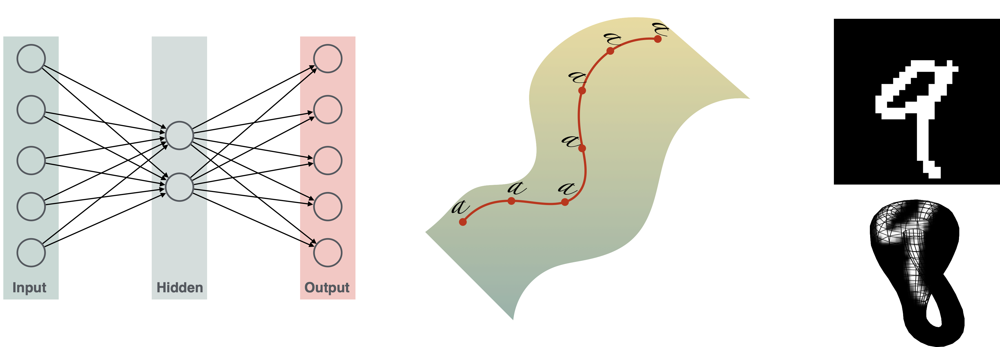

---

### Problem

.column-right[
  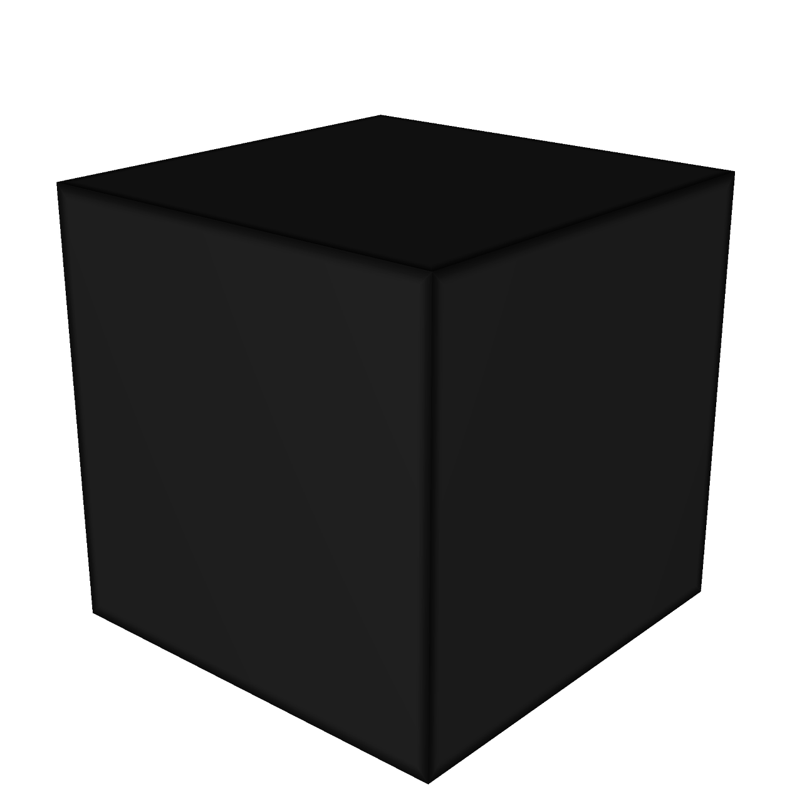
]

---
background-image: url(assets/bbs.png)

### Problem

---

### Aims

Define principled ways of looking at artificial neural networks and machine learning.

--

.column-left[
- Group equivariant non-expansive operators
  
  - Define suitable topological and metric spaces for machine learning.
  - Implement the formal results.
  - Control the learning process of a neural network.
]

--

.column-left[
- Parametric Machines

  - Formalize the notion of *neural network* and *neural architecture*.
  - Define a *space of admissible architectures*.
  - Determine the optimal architecture for a given problem.
]

---

.column-left[
  ### GENEOs

  Towards a topological-geometrical theory of group equivariant non-expansive operators for data analysis and machine learning
  
  With **Patrizio Frosini**, **Nicola Quercioli**, and **Daniela Giorgi**

  #### References:

  - **Topological-geometrical**:
  Gabrielsson, R. B. & Carlsson, G. (2018) 
  
  - **Group equivariant**: Mallat, S. (2012), Zhang, C., et al. (2015), Mallat, S. (2016), Anselmi, F. (2019)
  
  - **Non-expansive**:
  Tishby, N. & Zaslavsky N. (2015)
  
  - **Operators**:
  Bengio, Y., et al. (2013)
  ]

.column-right[
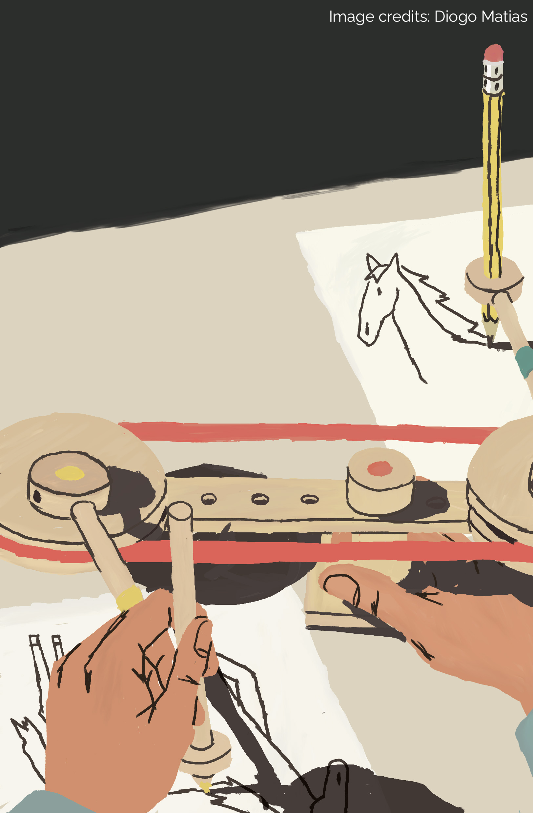
]

---

 ### Philisophical premises

.column-left[
 
<blockquote>
  1. The world is everything that is the case.
</blockquote>  
<blockquote>
  1.1 The world is the totality of facts, not of things. 
</blockquote>  
<blockquote>
  1.11 The world is determined by the facts, and by these being all the facts.
</blockquote>  
<blockquote>
  2.1 We make to ourselves pictures of facts. 
</blockquote>  
<blockquote>
  2.12 The picture is a model of reality.
  </blockquote>

<small>Tractatus Logico-Philosophicus. Ludwig Wittgenstein.</small>

]

.column-right[

]

---

### Intuition

<!--  -->
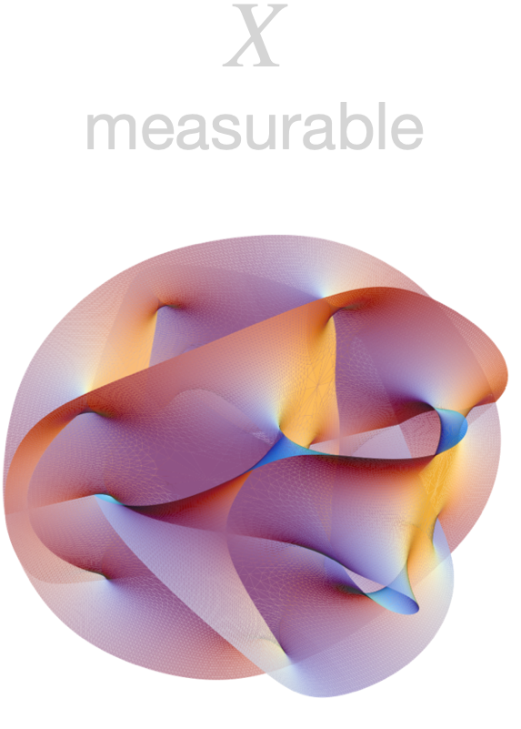
--
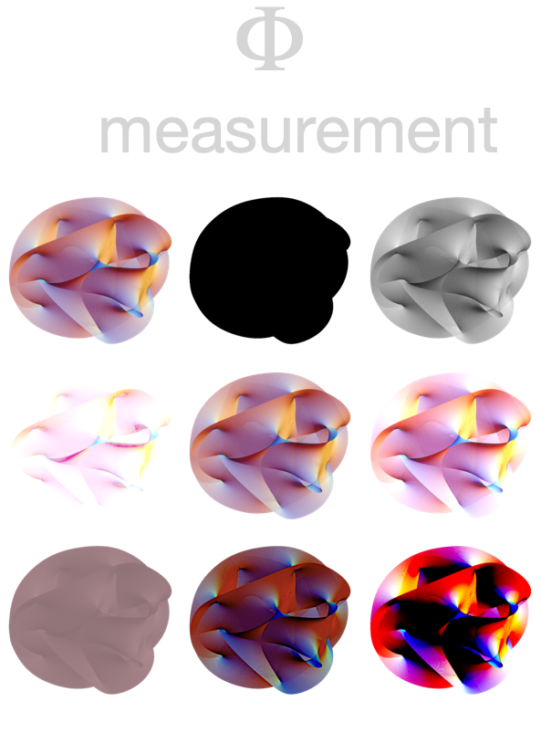
--
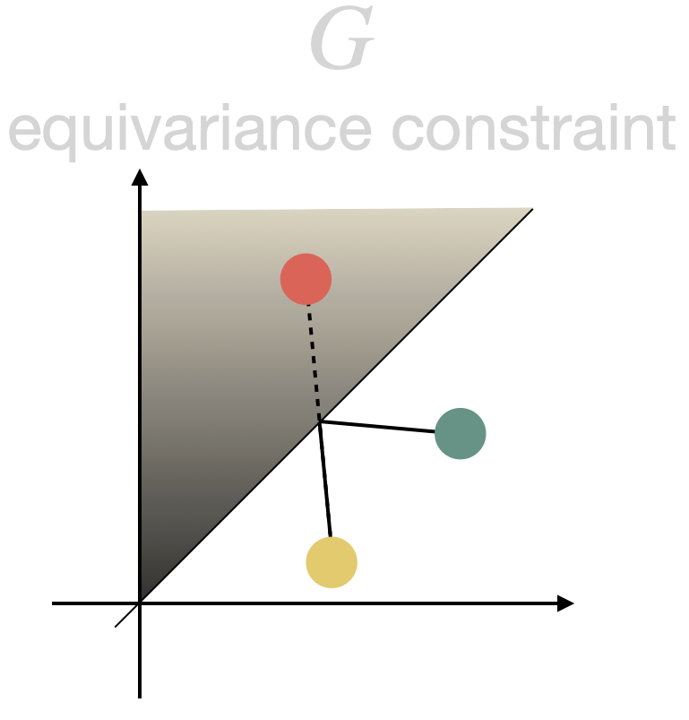
--
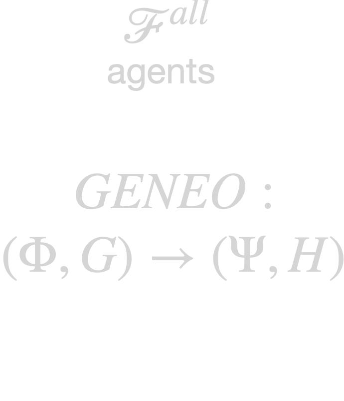

---

### Framework

| Space | Name |
|---|---|
| $X$ | Measurable signal |  
| $\Phi$ | Measurement |  
| $G$ | Equivariance constraint  |  
| $\mathcal{F}^{all}$ $(\Phi, G)\rightarrow (\Psi, H) $| GENEOs |  

---

count: false

### Framework

| Space | Name | Notation | (pseudo) Metric | 
|---|---|---|---|
| $X$ | Measurable signal | | |
| $\Phi$ | Measurement | $D_{\Phi}(\varphi\_1, \varphi\_2) = $ | $\Vert \varphi\_1, \varphi\_2 \Vert_{\infty}$ |
| $G$ | Equivariance constraint  |  |  |
| $\mathcal{F}^{all}$ $(\Phi, G)\rightarrow (\Psi, H) $| GENEOs |  |  |

---

count: false

### Framework

| Space | Name | Notation | (pseudo) Metric | 
|---|---|---|---|
| $X$ | Measurable signal | $D\_{X}(x_1, x_2) = $ | $\sup\_{\varphi\in\Phi}\vert \varphi(x\_1) - \varphi(x\_2)\vert$ |
| $\Phi$ | Measurement | $D_{\Phi}(\varphi\_1, \varphi\_2) = $ | $\Vert \varphi\_1, \varphi\_2 \Vert_{\infty}$ |
| $G$ | Equivariance constraint  |  |  |
| $\mathcal{F}^{all}$ $(\Phi, G)\rightarrow (\Psi, H) $| GENEOs |  |  |

---

count: false

### Framework

| Space | Name | Notation | (pseudo) Metric | 
|---|---|---|---|
| $X$ | Measurable signal | $D\_{X}(x_1, x_2) = $ | $\sup\_{\varphi\in\Phi}\vert \varphi(x\_1) - \varphi(x\_2)\vert$ |
| $(\Phi, G)$ | Measurement | $D_{\Phi}(\varphi\_1, \varphi\_2) = $ | $\Vert \varphi\_1, \varphi\_2 \Vert_{\infty}$ |
| $G$ | Equivariance constraint | $D\_{G}(g\_1, g\_2) = $ | $\sup\_{\varphi\in\Phi} D\_{\Phi} (\varphi\circ g\_1 - \varphi\circ g\_2)$ |
| $\mathcal{F}^{all}$ $(\Phi, G)\rightarrow (\Psi, H) $| GENEOs | | |

--

**Def** [Natural pseudo-distance]. 

  &nbsp;&nbsp;&nbsp;&nbsp;&nbsp;&nbsp;&nbsp;&nbsp;$d\_G:\Phi\times\Phi\rightarrow\mathbb{R}$

  &nbsp;&nbsp;&nbsp;&nbsp;&nbsp;&nbsp;&nbsp;&nbsp;$(\varphi\_1,\varphi\_2)\mapsto \inf\_{g\in G} D\_{\Phi}(\varphi\_1,\varphi\_2\circ g).$  

---

count: false

### Framework

| Space | Name | Notation | (pseudo) Metric | 
|---|---|---|---|
| $X$ | Measurable signal | $D\_{X}(x_1, x_2) = $ | $\sup\_{\varphi\in\Phi}\vert \varphi(x\_1) - \varphi(x\_2)\vert$ |
| $(\Phi, G)$ | Measurement | $D_{\Phi}(\varphi\_1, \varphi\_2) = $ | $\Vert \varphi\_1, \varphi\_2 \Vert_{\infty}$ |
| $G$ | Equivariance constraint | $D\_{G}(g\_1, g\_2) = $ | $\sup\_{\varphi\in\Phi} D\_{\Phi} (\varphi\circ g\_1 - \varphi\circ g\_2)$ |
| $\mathcal{F}^{all}$ $(\Phi, G)\rightarrow (\Psi, H) $| GENEOs | $D\_{\textnormal{GENEO}}(F\_1, F\_2) = $ | $\sup\_{\varphi\in\Phi} D\_\Psi (F\_1(\varphi),F\_2(\varphi))$ |

--

**Def** [GENEO] Def. Let $(\Phi, G)$ and $(\Psi, H)$ be two perception pairs and$T:G\rightarrow H$ a group homomorphism. A Group Equivariant Non-Expansive Operator (GENEO) from $(\Phi, G)$ to $(\Psi, H)$ is a map $F:\Phi\rightarrow\Psi$such that the following properties hold for every $\varphi,\varphi\_1,\varphi\_2\in\Phi$:
1. $F(\varphi\circ g) = F(\varphi)\circ T(g)$,
2. $D\_{\Psi}(F(\varphi\_1),F(\varphi\_2))\leq D\_{\Phi}(\varphi\_1,\varphi\_2)$

---

count: false

### Framework

| Space | Name | Notation | (pseudo) Metric | 
|---|---|---|---|
| $X$ | Measurable signal | $D\_{X}(x_1, x_2) = $ | $\sup\_{\varphi\in\Phi}\vert \varphi(x\_1) - \varphi(x\_2)\vert$ |
| $(\Phi, G)$ | Measurement | $D_{\Phi}(\varphi\_1, \varphi\_2) = $ | $\Vert \varphi\_1, \varphi\_2 \Vert_{\infty}$ |
| $G$ | Equivariance constraint | $D\_{G}(g\_1, g\_2) = $ | $\sup\_{\varphi\in\Phi} D\_{\Phi} (\varphi\circ g\_1 - \varphi\circ g\_2)$ |
| $\mathcal{F}^{all}$ $(\Phi, G)\rightarrow (\Psi, H) $| GENEOs | $D\_{\textnormal{GENEO}}(F\_1, F\_2) = $ | $\sup\_{\varphi\in\Phi} D\_\Psi (F\_1(\varphi),F\_2(\varphi))$ |

**Thm**. $\mathcal{F}^{all}$ is compact with respect to $D\_{\textnormal{GENEO}}$.

**Cor**. $\mathcal{F}^{all}$ can be $\varepsilon$-approximated by a finite subset.

**Thm**. If $\Psi$ is convex, then so is $\mathcal{F}^{all}$.

---

.column-right[
  
]

.column-left[
  ### From framework toward applications: ingredients

**Compactness**. $\mathcal{F}^{all}$ is compact with respect to $D\_{\textnormal{GENEO}}$.

**Approximability**.  $\mathcal{F}^{all}$ can be $\varepsilon$-approximated by a finite subset of operators.
]

--

.column-left[
**Ground truth**. $d\_G(\varphi\_1,\varphi\_2)= \inf\_{g\in G} D\_{\Phi}(\varphi\_1,\varphi\_2\circ g).$ 
]

--

.column-left[

  **Matching.**
  Let $\mathcal{F}$ be a finite approximation of $\mathcal{F}^{\textrm{all}}$.

  $D^\mathcal{F}\_{match} (\varphi\_1 ,\varphi\_2 ) = \sup\_{F\in\mathcal{F}} d\_{match} (Dgm(F(\varphi\_1)),Dgm(F(\varphi\_2))).$
]

--

.column-left[
  **Lower bound.** $d\_G(\varphi\_1,\varphi\_2) − D\_{match}^\mathcal{F} (\varphi\_1,\varphi\_2)\leq 2 \varepsilon$
]

---
### Persistence interlude

What is $Dgm$ in the definition of $D^\mathcal{F}\_{match}$?

--

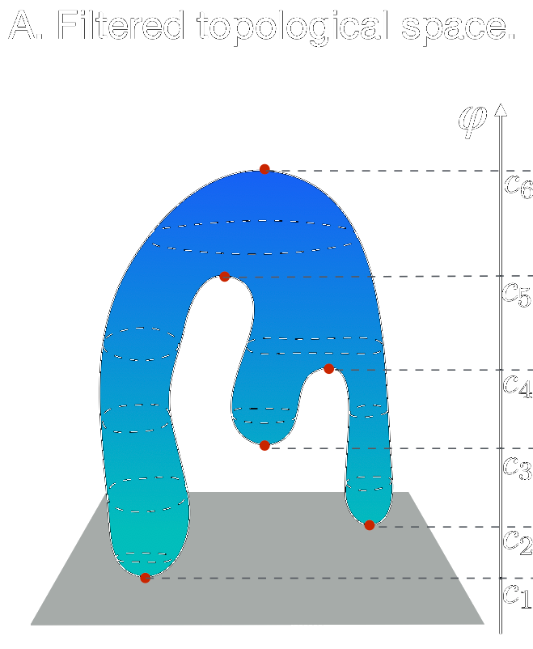
--
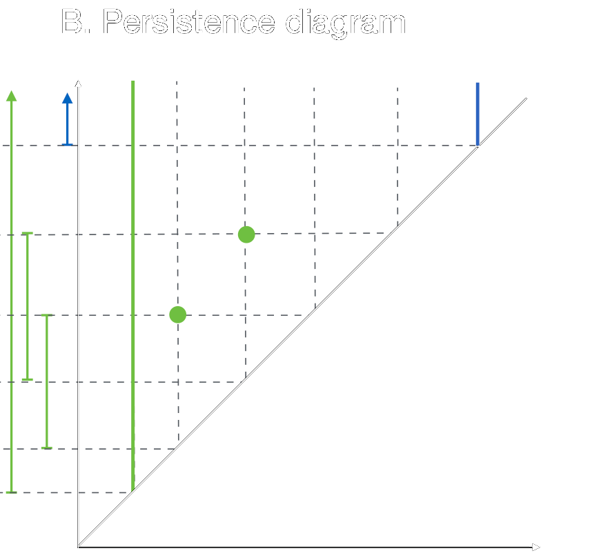
--
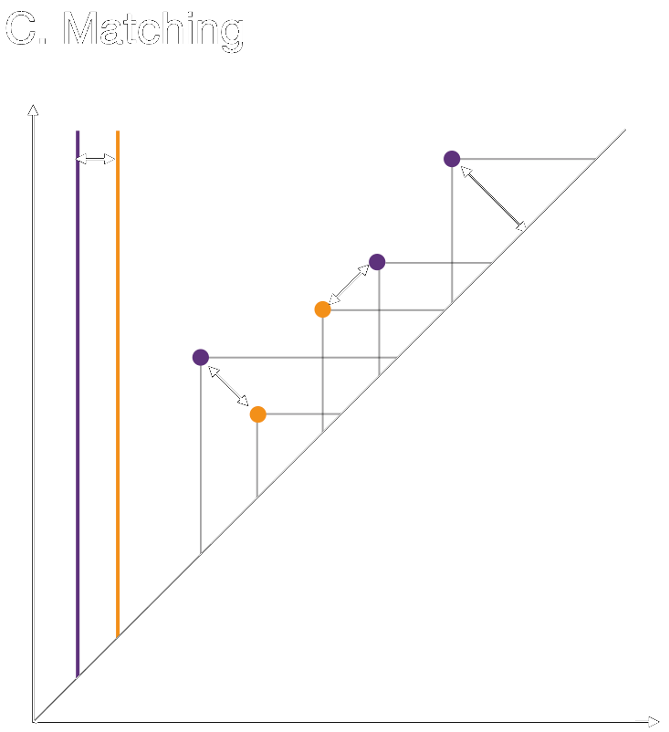

---

### Isometry equivariant non-expansive operators

$g\_{\tau}(t):=e^{-\frac{\left(t-\tau\right)^2}{2\sigma^2}}$

--

$G\_p(x,y):=\sum\_{i=1}^{k}a\_i g\_{\tau\_i}\left(\sqrt{x^2+y^2}\right)$

--

$\psi(x,y):=\int\_{\mathbb{R}^2}\varphi(\alpha,\beta)\cdot\frac{G\_p(x-\alpha,y-\beta)}{\|G\_p\|\_{L^1}}\ d\alpha\ d\beta$

--

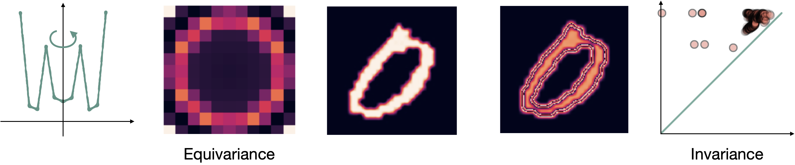

---

### The many expert operators problem

.column-left[
  #### Selection

  $s\_{l}\left(F \right) = \max\_{\varphi\_{i}^{l},\varphi\_{j}^l}d\_{\mathrm{match}}\left(Dgm\_k\left(F\left(\varphi\_{i}^{l}\right)\right),Dgm\_k\left(F\left(\varphi\_{j}^{l}\right)\right)\right)$
]

--

.column-left[
  #### Sampling

  $\Delta^{l}\_\mathrm{GENEO}\left(F\_{p},F\_{q}\right)=
  \max\_{\varphi\_{i}^{l}}d\_{\mathrm{match}}\left(Dgm\_k\left(F\_{p}\left(\varphi\_{i}^{l}\right)\right),Dgm\_k\left(F\_{q}\left(\varphi\_{i}^{l}\right)\right)\right)$
]

--

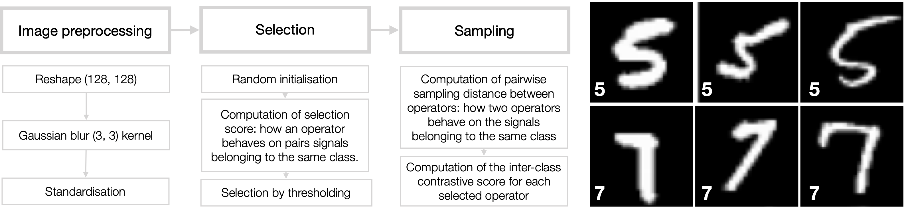

---

### Results - Metric learning

.column-left[
  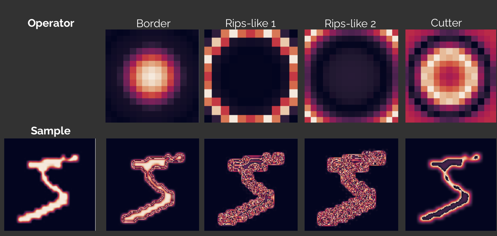

]

--

.column-right[

  |Dataset| Ops |  Filter size |
  |---|---|---|
  | MNIST | 500 | $7\times 7$

  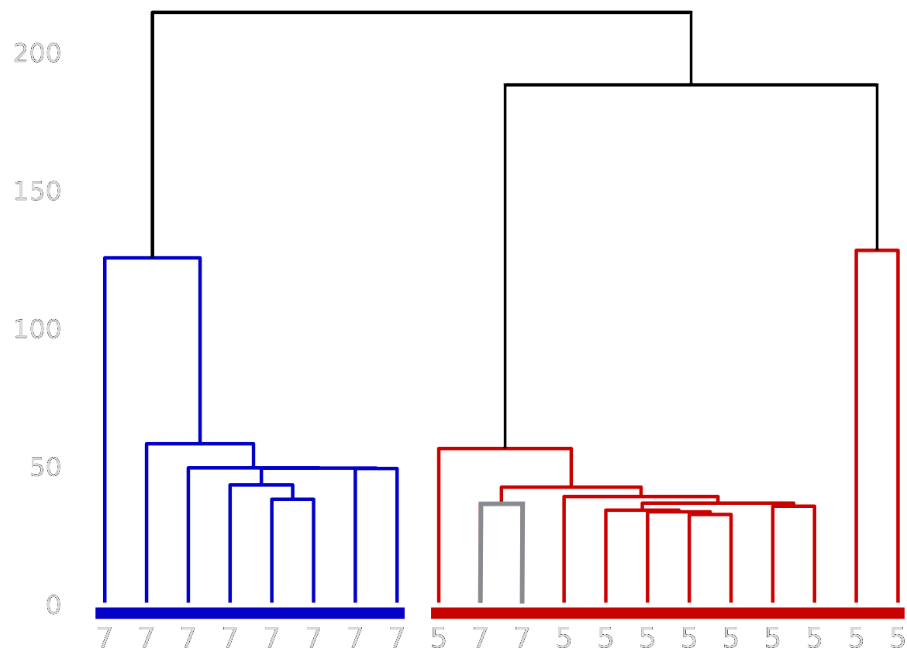
]

---

### Results - Generalization
.column-left[
  |Dataset| Ops |  Filter size |
  |---|---|---|
  | fashion-MNIST | 500 | $7\times 7$
  | CIFAR10 | 500 | $7\times 7$
]

--

.column-right[
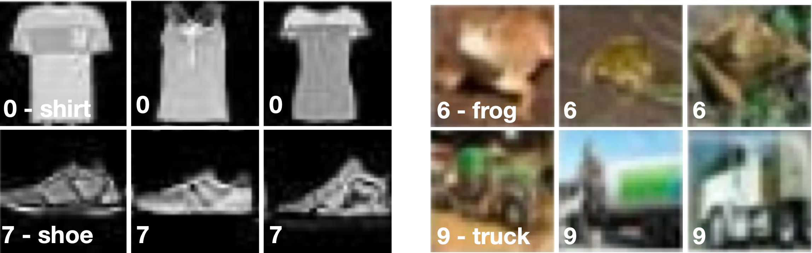
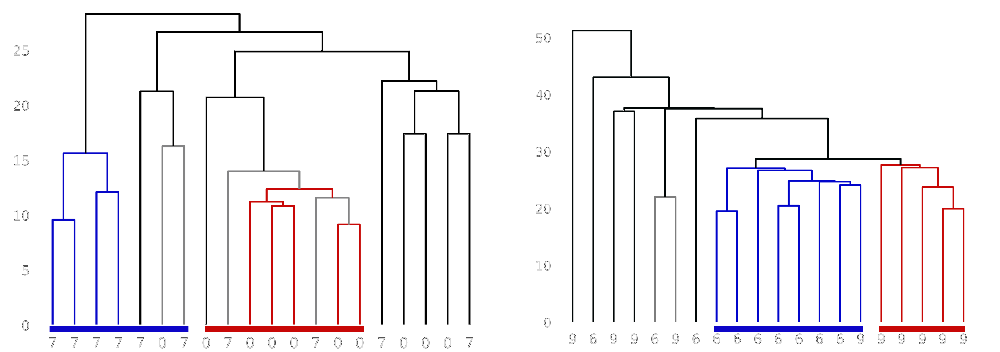
]

---

### Results - Equivariance

.column-left[
  ##### Filter size: $7\times 7$
]
.column-right[
  ##### $11\times 11$
]

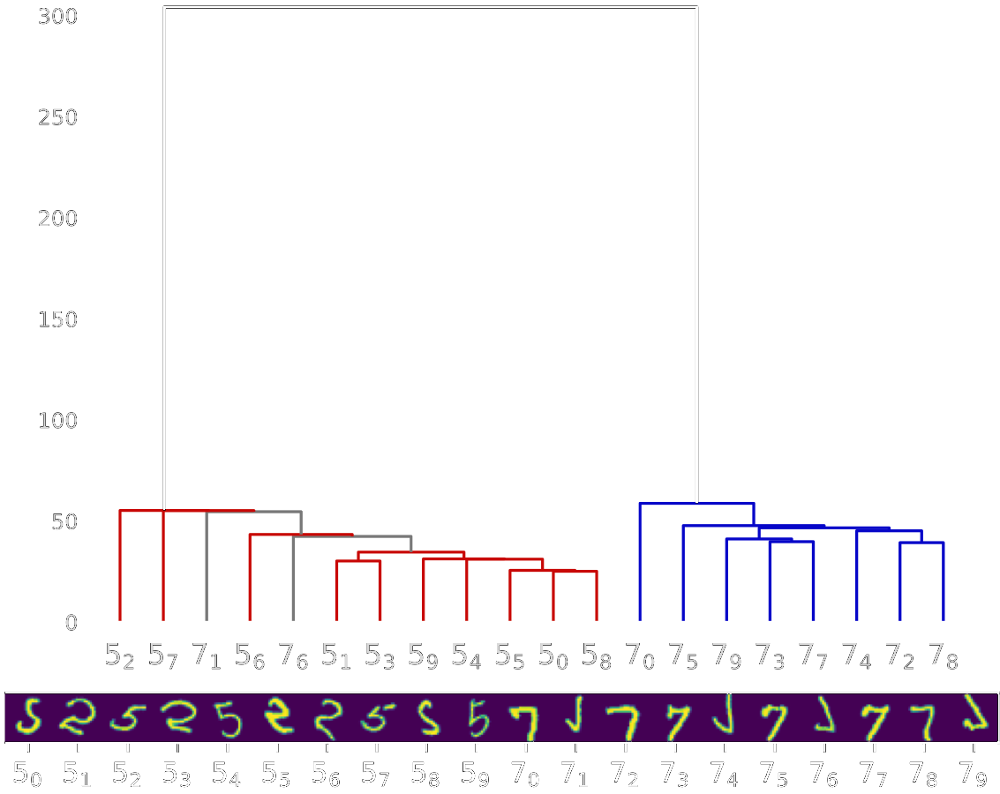
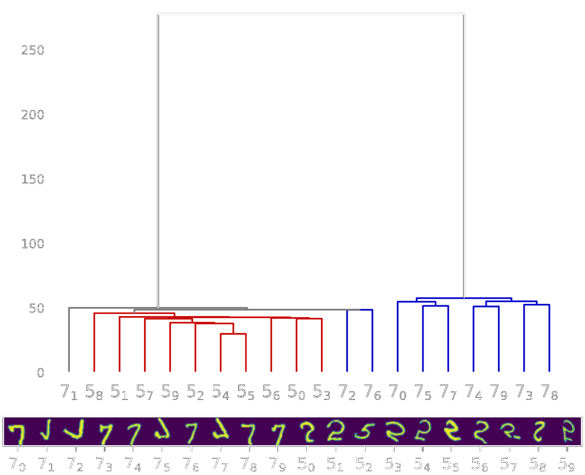

---

### Knowledge injection

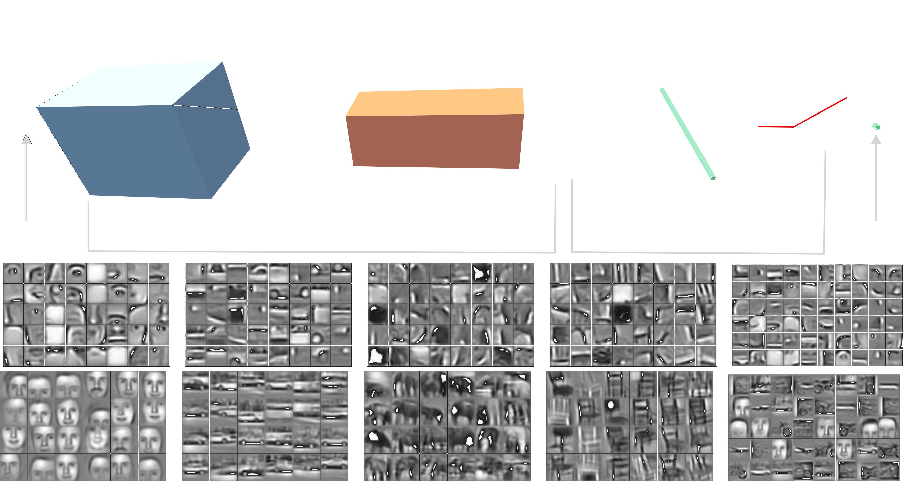

<small>Image adapted from Lee, H., et al. (2009). Proceedings of the 26th annual international conference on machine learning.</small>
---

### Knowledge injection

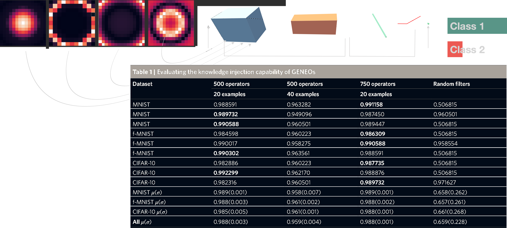

---

.column-left[
### Take-home messages

- GENEO spaces are suitable for machine learning

- The metrics defined on the space of GENEO can be used to
  - Select operators suitable to a given task
  - Sample  operators to avoid storing redundant information

- The theory developed on continuous signal spaces generalises to 
discrete datasets

- The equivariance grants robustness of the metric learnt via 
selection and sampling with respect to transformations induced 
by $G$ on the space of signals.

- Selection and sampling allow one to inject knowledge in 
state-of-the-art deep learning systems
]

.column-right[

]

---
.column-left[
  ### From GENEOs to Parametric Machines
  #### Questions
  
  - If GENEOs can be used to inject knowledge in a network, can we design a network of GENEOs?

  - Is it possible to define a space whose points are equivariant neural networks?
]

.column-right[
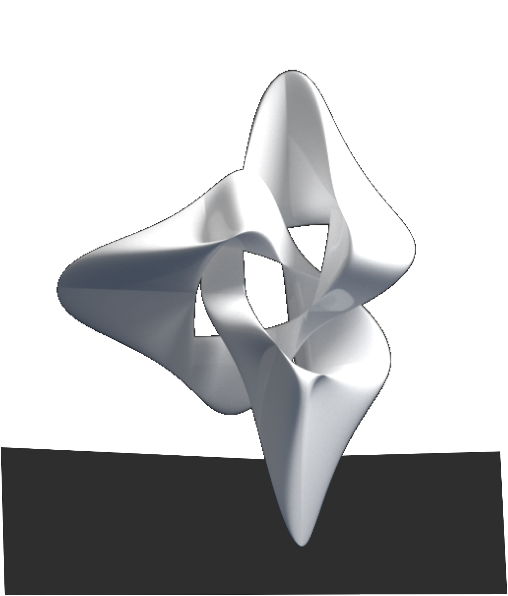
]

---

count: false

.column-left[
  ### From GENEOs to Parametric Machines
  #### Motivations

  - Modern machine learning relies on complex, hand-crafted architectures.

  - Designing such architectures is a difficult, time-consuming problem.

  - Complex data processing requires deep architectures.

  - Architecture depth can cause pathologies (instability, vanishing gradients).

]

.column-right[

| | |
|---|---|---|
|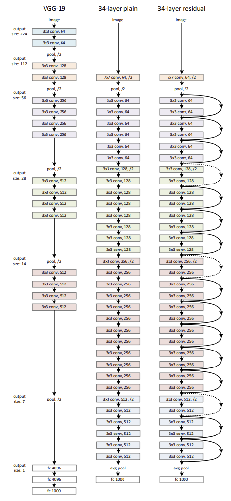||
|<small>He et al., 2015</small>|<small>Vaswani et al., 2017</small>|
]

---

### A principled approach

.container[
- Formalize the notion of *neural network* and *neural architecture*.

- Define a *space of admissible architectures*.

- Determine the optimal architecture for a given problem.
]

---

### Formalizing neural networks - composition

The first step is to formalize how layers are combined to form a larger
architecture.

 
 

Intuitively, function composition is the natural operation.

$$X_0 \rightarrow X_1 \rightarrow \dots \rightarrow X_n$$

Unfortunately, this does not include shortcut connections.

--

  

  <small>He et al., 2015</small>

  

  <small>Noori et al., 2020</small>

---

### Formalizing neural networks - stable state

.column-left.long[
Alternatively, given layers

$$X_0 \xrightarrow{l_1} X_1 \xrightarrow{l_2} \dots \xrightarrow{l_n} X_n,$$

consider the global space

$$X = X_0 \oplus X_1 \oplus \dots \oplus X_n$$

and the global network function

$$f = l_1 + \dots + l_n \colon X \rightarrow X.$$
]

--

.column-right[
Given a starting point
$$(x\_0, 0, 0, \dots, 0) \in X\_0 \oplus X\_1 \oplus X\_2 \oplus \dots \oplus X\_n,$$
consider the evolution
\\[
  \begin{aligned}
  &(x\_0,\; 0,\; 0,\; \dots,\; 0)\\\\
  &(x\_0,\; l\_1(x\_0),\; 0,\; \dots,\; 0)\\\\
  &(x\_0,\; l\_1(x\_0),\; l\_2(l\_1(x\_0)),\; \dots,\; 0)\\\\
  &\vdots\\\\
  &(x\_0,\; l\_1(x\_0),\; l\_2(l\_1(x\_0)),\; \dots,\; l\_n(l\_\{n-1\}\dots(l\_1(x\_0))))\\\\
  \end{aligned}
\\]
]

--

.column-right[
  End point is solution of
  $$x = f(x) + x_0$$
]

---

### Formalizing neural networks - stable state

.container[
The output of a network $f$ with input $x_0$ is any $x$ such that

$$x = f(x) + x_0,$$

that is to say, a stable state of the dynamical system

$$x \mapsto f(x) + x_0.$$
]

--

.container[
**Definition.**

We say that $f$ is a *machine* if, for any $x_0$, there is a unique solution to
$$x = f(x) + x_0,$$
and this unique solution depends smoothly on $x_0$.

Given a function in two arguments $f(x, p)$, we say that $f$ is a *parametric machine*
if, for all $p$, $f(-, p)$ is a machine.
]

---

### What is next

.column-left[
- We provide a solid categorical foundation for the study of deep neural networks.

- The stable state generalizes the computation of a feedforward neural network.

- This notion encompasses both manually designed neural network architectures,
as well as their continuous counterpart such as Neural ODEs.

- We show how to build a complex machine from smaller machines with independence assumptions.

- Nonlinear integral Volterra equations of the second kind are machines.

- Finite- and infinite-depth kernel machines are suitable for small datasets.
]

--

.column-right[
  #### References

  - [Bergomi, M. G., Frosini, P., Giorgi, D., & Quercioli, N. (2019). Towards a topological–geometrical theory of group equivariant non-expansive operators for data analysis and machine learning. Nature Machine Intelligence, 1(9), 423-433.](https://arxiv.org/pdf/1812.11832.pdf)
  - [Vertechi, P., & Bergomi, M. G. (2020). Parametric machines: a fresh approach to architecture search. arXiv preprint arXiv:2007.02777.](https://arxiv.org/pdf/2007.02777.pdf)
]

---

layout: false
class: center

{pietro.vertechi, mattia.bergomi}@veos.digital
