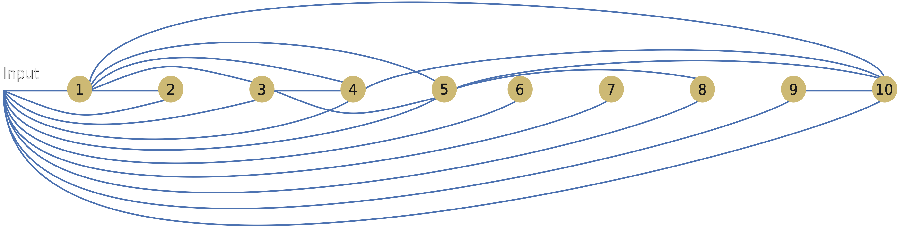

  <h1 class="almost_white">From parametric to quiver machines</h1>
  <h3 class="almost_white">Pietro Vertechi & Mattia Bergomi</h3>
  <h4 class="almost_white">{pietro.vertechi, mattia.bergomi}@veos.digital</h4>

  

    
  

---

layout: true

  

---

### Table of contents

- Introduction
  - Historical overview
  - Aims and contributions
- Machines
  - Stable state
  - Parameterization
  - Independence
- Machine-based data analysis
  - Hypergraph machines
  - Applications
  - Functional data analysis
  - Volterra machines
- Kernel methods
  - Finite-depth kernel machines
  - Applications
  - Infinite-depth kernel machines
  - Applications
- Conclusions
- Future directions
  - Quiver machines

---

### Introduction

.column-left[
- Neurally-inspired architectures are a relatively old idea.

- One of the first artificial decision-makers was Rosenblatt's *perceptron* (1958).

- A single unit applies a squashing nonlinear transformation to a weighted sum of input units.
]

--

.column-right[
  

  <small>Image credits: Francesco Cicala</small>
]

---

count: false

### Introduction

.column-left[
- Neurally-inspired architectures are a relatively old idea.

- One of the first artificial decision-makers was Rosenblatt's *perceptron* (1958).

- A single unit applies a squashing nonlinear transformation to a weighted sum of input units.

- Limitations of the perceptron were discovered quickly.

- For instance, this network cannot learn to return a positive output when exactly one of the inputs is positive (XOR problem).
]

.column-right[
  

  <small>Image credits: Francesco Cicala</small>
]

---

count: false

### Introduction

.column-left[
- The XOR problem was solved by *stacking* perceptrons.

- *Multilayer perceptrons* with sufficiently many *hidden neurons* are universal function approximators.
]

.column-right[
  

  <small>Gong and Murayama - 2016</small>
]

---

### Introduction

.column-left[
- In modern machine learning, the multilayer perceptron has been replaced by complex, hand-crafted architectures.

- Designing such architectures is a difficult, time-consuming problem.
]

--

.column-right[

<small>Vaswani et al., 2017</small>
]

---

count: false

### Introduction

.column-left[
- In modern machine learning, the multilayer perceptron has been replaced by complex, hand-crafted architectures.

- Designing such architectures is a difficult, time-consuming problem.

- Complex data processing requires deep architectures.

- Architecture depth can cause pathologies (instability, vanishing gradients).
]

--

.column-right[

<small>He et al., 2015</small>
]

---

### A principled approach

.container[
- Formalize the notion of *neural network* and *neural architecture*.

- Define a *space of admissible architectures*.

- Determine the optimal architecture for a given problem.
]

---

### Formalizing neural networks - composition

The first step is to formalize how layers are combined to form a larger
architecture.

 
 

Intuitively, function composition is the natural operation.

$$X_0 \rightarrow X_1 \rightarrow \dots \rightarrow X_n$$

Unfortunately, this does not include shortcut connections.

--

  

  <small>He et al., 2015</small>

  

  <small>Noori et al., 2020</small>

---

### Formalizing neural networks - stable state

.column-left.long[
Alternatively, given layers

$$X_0 \xrightarrow{l_1} X_1 \xrightarrow{l_2} \dots \xrightarrow{l_n} X_n,$$

consider the global space

$$X = X_0 \oplus X_1 \oplus \dots \oplus X_n$$

and the global network function

$$f = l_1 + \dots + l_n \colon X \rightarrow X.$$
]

--

.column-right[
Given a starting point
$$(x\_0, 0, 0, \dots, 0) \in X\_0 \oplus X\_1 \oplus X\_2 \oplus \dots \oplus X\_n,$$
consider the evolution
\\[
  \begin{aligned}
  &(x\_0,\; 0,\; 0,\; \dots,\; 0)\\\\
  &(x\_0,\; l\_1(x\_0),\; 0,\; \dots,\; 0)\\\\
  &(x\_0,\; l\_1(x\_0),\; l\_2(l\_1(x\_0)),\; \dots,\; 0)\\\\
  &\vdots\\\\
  &(x\_0,\; l\_1(x\_0),\; l\_2(l\_1(x\_0)),\; \dots,\; l\_n(l\_\{n-1\}\dots(l\_1(x\_0))))\\\\
  \end{aligned}
\\]
]

--

.column-right[
  End point is solution of
  $$x = f(x) + x_0$$
]

---

### Formalizing neural networks - stable state

.container[
The output of a network $f$ with input $x_0$ is any $x$ such that

$$x = f(x) + x_0,$$

that is to say, a stable state of the dynamical system

$$x \mapsto f(x) + x_0.$$
]

--

.container[
**Definition.**

We say that an endofunction $f$ is a *machine* if, for any $x_0$, there is a unique solution to
$$x = f(x) + x_0,$$
and this unique solution depends smoothly on $x_0$.

Given a function in two arguments $f(p, x)$, we say that $f$ is a *parametric machine*
if, for all $p$, $f(p, -)$ is a machine, and $(p, x\_0) \mapsto x$ is smooth.
]

---

### Formalizing neural networks - independence

.container[
Let $f_1, f_2$ be two endofunctions with the same domain $X$.
We say that $f_1$ *does not depend* on $f_2$ if, for all $b_1, b_2 \in X$ and
$\lambda \in \mathbb R$,

$$f_1(b_1 + \lambda f_2(b_2)) = f_1(b_1).$$
]

--

.container[
It is straightforward to compute the stable state mapping $(I - f)^{-1}$ of $f = f_1 + f_2$, where $f_1$  *does not depend* on $f_2$.

\\[
  (I - f_1)(I - f_2) = I(I - f_2) - f_1(I - f_2) = I - f_2 - f_1.
\\]

Hence:
$$(I - f_1 - f_2)^{-1} = (I - f_2)^{-1}(I - f_1)^{-1}.$$

In other words, the stable state of $f_1 + f_2$ is the composition of the stable states of $f_1$ and $f_2$.
]

--

.container[
If $f$ does not depend on itself, then $(I - f)^{-1} = I + f$.
]

---

### Classical architectures

.container[

$l_i$ does not depend on $l_j$ for $i \le j$:

$$X_0 \xrightarrow{l_1} X_1 \xrightarrow{l_2} \dots \xrightarrow{l_n} X_n,$$

The stable state can be computed as follows:

$$(I - l_1 - \cdots - l_n) ^{-1} = (I + l_n) \cdots (I + l_1).$$
]

--

.container[
In practice:

\\[
  \begin{aligned}
  &(x\_0,\; 0,\; 0,\; \dots,\; 0)\\\\
  &(x\_0,\; l\_1(x\_0),\; 0,\; \dots,\; 0)\\\\
  &(x\_0,\; l\_1(x\_0),\; l\_2(l\_1(x\_0)),\; \dots,\; 0)\\\\
  &\vdots\\\\
  &(x\_0,\; l\_1(x\_0),\; l\_2(l\_1(x\_0)),\; \dots,\; l\_n(l\_\{n-1\}\dots(l\_1(x\_0))))\\\\
  \end{aligned}
\\]
]

---

exclude: true

### Classical architectures - intuition

.container[
The function $l = l_1 + \cdots + l_n$ is a machine for the following reason.

Let us consider the projection:

$$\pi_k \colon X_0 \oplus \dots \oplus X_n \rightarrow X_0 \oplus \dots \oplus X_k.$$

Then,

$$\pi\_k l \pi\_{k-1} = \pi\_k l,$$

hence we can compute the forward pass space by space.

This is completely analogous to the forward pass of a layer-by-layer architecture.
]

---

### Hypergraph machines

  .column-left[
  Hypergraphs allow for edges to connect to arbitrarily large collections of vertices.
  Thus shortcut connections can be very complex.

  ]
--
  

    
  

--

  

    In this example, we have layers $\{l_1, \dots, l_5\}$, and the representation
    corresponds to a neural network mapping

    $$
    (x_1,\; x_2,\; x_3,\; x_4,\; \dots, x_8) \mapsto (x_1,\; x_2,\; l_1(x_1, x_2) + x_3,\; l_2(l_1(x_1, x_2) + x_3) + x_4,\; \dots,\; l_5(l_4(l_2(l_1(x_1, x_2) + x_3) + x_4) + x_5) + x_8 )
    $$
  

---

### Hypergraph application - machine definition

.column-left[
We can consider as starting architecture a directed graph whose nodes are
*activation functions*, and edges are *layers*.
]
--

  

---

### Hypergraph application - training and pruning

.column-left[
During training edges having sufficiently small Euclidean norm are pruned
]

  

---

### Hypergraph application - training and pruning

.column-left[
During training edges having sufficiently small Euclidean norm are pruned
]

  

---

### Hypergraph application - training and pruning

.column-left[
This process allows for finding complex convolutional architectures with
shortcut connections and minimal number of parameters without affecting the
overall performance of the network.
]

  

---

### Interlude

.container[
1. Hand-crafted architectures requires highly trained experts, and time-consuming fine-tuning.

2. We created a formal environment in which complex architectures and, more in general, machines can be described.

3. It is possible to describe machines via hypergraph (and their layering).

4. This construction allows for optimizing weights and architecture at the same time.
]

---

exclude: true

### Contraction principle

.container[
Let us assume that $f$ "reduces distances". For example,
$$\left\Vert f(x) - f(y) \right\Vert \le 0.9 \left\Vert x - y \right\Vert.$$

Then the sequence
$$x_{n+1} = f(x_n) + x_0$$
converges to a fixed point $x = f(x) + x_0$, the stable state of $f$.
]

---

### Functional data analysis - intuition
.column-left[
Data can be seen as functions.
For instance, a handwritten trace can be seen as a static object, but also as
functions that describe the horizontal and vertical displacement in time.
]

.column-right[

]
--

.column-left[
From this perspective, **functional analysis** is one of the most suitable framework to
operate on data.
]

---

exclude: true

### Functional data analysis - intuition
.container[
We call a *function space*, a space whose points are functions.

**Examples.**
1. $C(I)$ is the space of all continuous functions on $I\subset\mathbb{R}$;
2. $L_1(I)$ is the space of functions on $I$, whose absolute value is integrable;
3. $L_2(I)$ are square integrable functions on $I$.
]

.container[
#### Hilbert spaces
Hilbert spaces are function spaces that, for simplicity, we can now think about
as infinite-dimensional vector spaces, with a *dot* product.
]

---

### Volterra machines

.container[
*Continuous machines* can be defined in the setting of functional analysis.

Let $K(t, s, u)$ be a function $[0, 1] \times [0, 1] \times X \rightarrow X$,
with some regularity assumption (uniformly Lipschitz in $u$).
]

--

.container[
Then the mapping
$$(\mathcal{F} u)(t) = \int_0^t K(t, s, u(s)) ds$$
is a *machine* on $L_2([0, 1], X)$.
]

--

.container[
Stable state is solution of nonlinear integral Volterra equation of second kind:

$$ \psi \mapsto \phi \,\, \text{ where, for all } t \in [0, 1], \,\, \phi(t) = \psi(t) + \int_0^t K(t, s, \phi(s)) ds$$
]

---

exclude: true

### Volterra machines - intuition

.container[
The function $f$ is a machine for the following reason.

Let us consider the projection:
$$\pi_t \colon L_2([0, 1], X) \rightarrow L_2([0, t], X).$$
Then,
$$\pi_t f \pi_t = \pi_t f,$$
and, together with a regularity condition, this allows us to solve it with numerical
integration.
]

---

### Volterra machines - potential applications

.column-left[
Volterra machines generalize Ordinary Differential Equations (ODEs).

Whenever $K(t, s, u) = K(s, u)$ then the stable state of the Volterra machines is the
solution to the ODE:
$$\frac{du}{ds} = K(s, u(s)),$$
thus our framework generalizes Neural ODEs (Chen at al., 2018).
]

--

.column-right[

<small>Image credits: Niall Twoney</small>
]

--

.column-left[
**Unresolved question.** How to best take advantage of the dependency on $t$?
]

---

### Constraining the problem - kernel methods

.column-left[
Kernel method = Hilbert space $H$ of functions $X \rightarrow X$.

- Norm of a function (regularity).
- Well-behaved distance between functions.
]

---

count: false

### Constraining the problem - kernel methods

.column-left[
Kernel method = Hilbert space $H$ of functions $X \rightarrow X$.

- Norm of a function (regularity).
- Well-behaved distance between functions.

**Operator-valued kernel methods.** Let $\mathcal{L}(X)$ be the space of linear endomorphisms of $X$,
and $K \colon X \times X \rightarrow \mathcal{L}(X)$ a kernel such that

- for all $x\_1, x\_2$, $K(x\_1, x\_2)$ is self-adjoint,
- for all $x\_i, c\_i \in X$, $\sum\_{i, j} c\_i \cdot K(x\_i, x\_j) c\_j \ge 0$.
]

--

.column-right[
$K$ defines a Hilbert space of functions $X \rightarrow X$, analogous to a key idea of kernel methods (Kernel Ridge regression, Support Vector Machine, ...).

The *Reproducing Kernel Hilbert Space* of $K$ is the closure of functions of the type
$$f = K(-, x_1) c_1 + \dots + K(-, x_n) c_n.$$
]

--

.column-right[
<!-- **Important.** Every such function $f$ is automatically equipped with a norm $\left\Vert - \right\Vert$. -->
<!-- Small norm $\Leftrightarrow$ regular solution. -->

We look for $K$ such that the evaluation map $\varrho\colon H \times X \rightarrow X$ is a parametric machine.
We call any such $K$ a *kernel machine*.
]

---

### Kernel machines

.column-left[
**Theorem.** Let $K$ be a kernel machine. Let $\\{ x\_i \\}\_1 ^n$ be a training dataset.
For every machine $f \in H$, there exists a machine $\hat f \in H$ of the form
$$\hat f = \sum_{i=1}^n K(-, x_i) c_i$$
such that
- stable states of $f$ and $\hat f$ agree on $\\{ x\_i \\}\_1 ^n$,
- $\lVert \hat f \rVert \le \lVert f \rVert$.
]

---

count: false

### Kernel machines

.column-left[
**Theorem.** Let $K$ be a kernel machine. Let $\\{ x\_i \\}\_1 ^n$ be a training dataset.
For every machine $f \in H$, there exists a machine $\hat f \in H$ of the form
$$\hat f = \sum_{i=1}^n K(-, x_i) c_i$$
such that
- stable states of $f$ and $\hat f$ agree on $\\{ x\_i \\}\_1 ^n$,
- $\lVert \hat f \rVert \le \lVert f \rVert$.

 

Actual number of parameters: $\dim(X) \cdot n$.
]

--

.column-right[
**Action plan.**
- Choose suitable spaces $X$, either finite-dimensional, e.g. $\mathbb R^d$, or infinite-dimensional, e.g. $L_2([0, 1], \mathbb R ^d)$.

- Choose a kernel $K$ on $X$ such that $\varrho\colon H \times X \rightarrow X$ is a parametric machines.

- Explore the smaller subspace of machines of the form $$\sum_{i=1}^n K(-, x_i) c_i.$$
]
---

### Finite-depth kernel machines - Applications
#### Fitting a 2d polynomial

.column-left.long[
We trained a kernel machine and a multilayer perceptron with the comparable
number of trainable parameters to fit
$$(2x - 1)^2 + 2y + xy - 3,$$
on a 6×6 grid of points.
]

.column-right[

]

--

.column-right[

]

---

### Finite-depth kernel machines - Applications
#### Interpolation of noisy data

.column-left.long[
We compared a kernel machine (514 parameters) in a noisy interpolation problem,
with a 2 layers perceptron (609 parameters) using both ReLU and sigmoid nonlinearities.
]

.column-right[

]

--

.column-right[

]

---

### Finite-depth kernel machines - Applications
#### Regularization

.column-left.long[
Finally, we can evaluate how different regularization coefficients affect the
performance of the kernel machine.
]

.column-right[

]

--

.column-right[

]

---

### Infinite-depth kernel machines - Applications
#### Learning MNIST with 1 sample

.column-left.long[
Heavy regularization (e.g. dropout) and augmentation are usually the strategies
that coupled with data augmentation allow one to learn from few data points.

We trained an infinite-depth kernel machine on one random sample per class of
the MNIST dataset and tested it on the 10000 test samples, obtaining a
performance of $\approx 50\%$.
]

--

.column-right[
Naively set methods obtain
<table style="width:100%">
  <tr>
    <th>SVM RBF</th>
    <th>k-NN</th>
    <th>NN</th></th>
  </tr>
  <tr>
    <td>41.9%</td>
    <td>41.9%</td>
    <td>42%</td>
  </tr>
</table>
]

---

exclude: true

### Infinite-depth kernel machines - Applications
#### Learning MNIST with 1 sample

.column-left.long[
Heavy regularization (e.g. dropout) and augmentation are usually the strategies
that coupled with data augmentation allow one to learn from few data points.

We trained an infinite-depth kernel machine on one random sample per class of
the MNIST dataset and tested it on the 10000 test samples, obtaining a
performance of $\approx 50\%$.
]

.column-right[

]

.column-right[

]

---

exclude: true

### Infinite-depth kernel machines - Applications
#### Learning MNIST with 1 sample

.column-left.long[
Heavy regularization (e.g. dropout) and augmentation are usually the strategies
that coupled with data augmentation allow one to learn from few data points.

We trained an infinite-depth kernel machine on one random sample per class of
the MNIST dataset and tested it on the 10000 test samples, obtaining a
performance of $\approx 50\%$.
]

.column-right[

]

.column-right[

]

---

### Conclusions

.container[
- We provide a solid categorical foundation for the study of deep neural networks.

- The stable state generalizes the computation of a feedforward neural network.

- This notion encompasses both manually designed neural network architectures,
as well as their continuous counterpart such as Neural ODEs.

- We show how to build a complex machine from smaller machines with independence assumptions.

- Nonlinear integral Volterra equations of the second kind are machines.

- Finite- and infinite-depth kernel machines are suitable for small datasets.
]

---

### Future directions: quiver machines

.column-left[

]

--

.column-right[

<small>Image credits: Ilya Voyager</small>
]

---

count: false

### Future directions: quiver machines

.column-left[

 

]

.column-right[

<small>Image credits: Ilya Voyager</small>
]

--

.column-right[

<small>Olszewski - 2001</small>
]

---
layout: false
class: center

{pietro.vertechi, mattia.bergomi}@veos.digital
