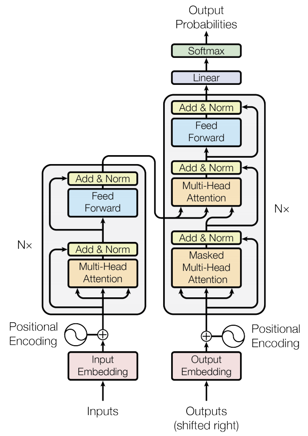
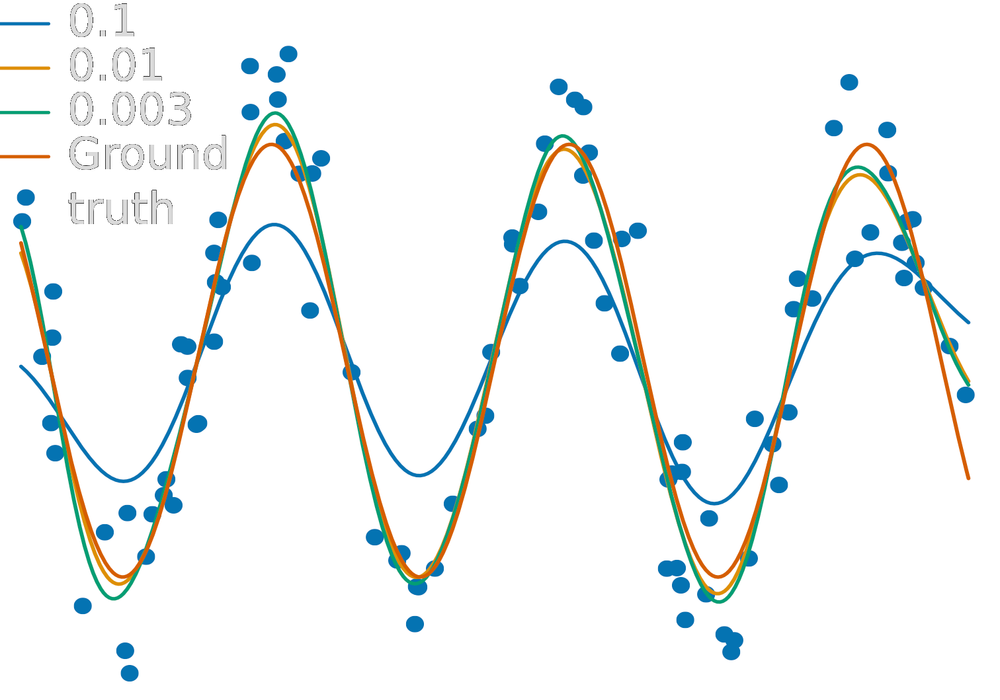

  <h1 class="almost_white">Parametric machines: a fresh approach to
                           architecture search</h1>
  <h3 class="almost_white">Mattia Bergomi, Pietro Vertechi</h3>
  <h4 class="almost_white">{mattia.bergomi, pietro.vertechi}@veos.digital</h4>

  

    
  

---

layout: true

  

---

### Applied Mathematics and Artificial Intelligence Lab

.column-left.long[
<h4>Aim in Veos Digital</h4>
We aim to create a virtuous circle where fundamental research, development and
business can nurture each other to create products difficult to reach when
following more standard approaches.
]

--

.column-left.long[
<h4>Internal Aim</h4>
The projects in the laboratory are devised to converge towards the investigation
of the interactions between biological and artificial intelligence. We
leverage modern machine learning techniques, and building on
classical mathematical frameworks.
]

---

### Parametric machines

.column-left[
This project originated from a study on equivariant operators [1].

Thereafter, thanks to Pietro's categorical approach, we started the parametric
machines framework, first described in [2].

<a href="https://www.nature.com/articles/s42256-019-0087-3"><small>[1] Bergomi, Frosini, Giorgi, Quercioli. Nature Machine Intelligence, 2019</small></a>

<a href="https://arxiv.org/abs/2007.02777"><small>[2] Vertechi, Frosini, Bergomi. Preprint, 2020</small></a>
]

.column-right[

Pietro Vertechi

<small>pietro.vertechi@veos.digital<small>
]

---

### Table of contents

- Introduction
  - Problem
  - Aim
  - Contributions
- Machines
  - Stable state
  - Parameterization
  - Independence
- Machine-based data analysis
  - Hypergraph machines
  - Applications
  - Functional data analysis
  - Finite-depth kernel machines
  - Applications
- Conclusions

---

### Introduction

.column-left[
- Modern machine learning relies on complex, hand-crafted architectures.

- Designing such architectures is a difficult, time-consuming problem.

- Complex data processing requires deep architectures.

- Architecture depth can cause pathologies (instability, vanishing gradients).
]

  

  <small>He et al., 2015</small>

  

  <small>Vaswani et al., 2017</small>

---

### A principled approach

.container[
- Formalize the notion of *neural network* and *neural architecture*.

- Define a *space of admissible architectures*.

- Determine the optimal architecture for a given problem.
]

---

### Formalizing neural networks
#### Composition

--

The first step is to formalize how layers are combined to form a larger
architecture.

 
 

Intuitively, function composition is the natural operation.

$$X_0 \rightarrow X_1 \rightarrow \dots \rightarrow X_n$$

Unfortunately, this does not include shortcut connections.

  

  <small>He et al., 2015</small>

  

  <small>Noori et al., 2020</small>

---

### Formalizing neural networks
#### Stable state

--

.column-left.long[
Alternatively, given layers

$$X_0 \xrightarrow{l_1} X_1 \xrightarrow{l_2} \dots \xrightarrow{l_n} X_n,$$

consider the global space

$$X = X_0 \oplus X_1 \oplus \dots \oplus X_n$$

and the global network function

$$f = l_1 + \dots + l_n \colon X \rightarrow X.$$
]

--

.column-right[
Given a starting point
$$(x\_0, 0, 0, \dots, 0) \in X\_0 \oplus X\_1 \oplus X\_2 \oplus \dots \oplus X\_n,$$
consider the evolution
\\[
  \begin{aligned}
  &(x\_0,\; 0,\; 0,\; \dots,\; 0)\\\\
  &(x\_0,\; l\_1(x\_0),\; 0,\; \dots,\; 0)\\\\
  &(x\_0,\; l\_1(x\_0),\; l\_2(l\_1(x\_0)),\; \dots,\; 0)\\\\
  &\vdots\\\\
  &(x\_0,\; l\_1(x\_0),\; l\_2(l\_1(x\_0)),\; \dots,\; l\_n(l\_\{n-1\}\dots(l\_1(x\_0))))\\\\
  \end{aligned}
\\]
]

--

.column-right[
  End point is solution of
  $$x = f(x) + x_0$$
]

---

### Formalizing neural networks
#### Stable state

.container[
The output of a network $f$ with input $x_0$ is any $x$ such that

$$x = f(x) + x_0,$$

that is to say, a stable state of the dynamical system

$$x \mapsto f(x) + x_0.$$
]

--

.container[
**Definition.**

We say that $f$ is a *machine* if, for any $x_0$, there is a unique solution to
$$x = f(x) + x_0,$$
and this unique solution depends smoothly on $x_0$.

Given a function in two arguments $f(x, p)$, we say that $f$ is a *parametric machine*
if, for all $p$, $f(-, p)$ is a machine.
]

---

### Formalizing neural networks
#### Independence

--

.container[
In practice we are computing $(I - f)^{-1}$, that is

$$x = (I - f)^{-1}(x_0).$$
]

--

.container[
If $f = f_1 + f_2$ and $f_1(af_2 + b) = f_1(b)$ then

\\[
  (I - f_1)(I - f_2) = I(I - f_2) - f_1(I - f_2) = I - f_2 - f_1.
\\]
]

--

.container[
Hence:
$$(I - f_1 - f_2)^{-1} = (I - f_2)^{-1}(I - f_1)^{-1}.$$

We say that $f_1$ *does not depend* on $f_2$.

If $f$ does not depend on itself, then $(I - f)^{-1} = I + f$.

]

---

### Classical architectures

.container[

$l_i$ does not depend on $l_j$ for $i \le j$:

$$X_0 \xrightarrow{l_1} X_1 \xrightarrow{l_2} \dots \xrightarrow{l_n} X_n,$$

The stable state can be computed as follows:

$$(I - l_1 - \cdots - l_n) ^{-1} = (I + l_n) \cdots (I + l_1).$$

In practice:

\\[
  \begin{aligned}
  &(x\_0,\; 0,\; 0,\; \dots,\; 0)\\\\
  &(x\_0,\; l\_1(x\_0),\; 0,\; \dots,\; 0)\\\\
  &(x\_0,\; l\_1(x\_0),\; l\_2(l\_1(x\_0)),\; \dots,\; 0)\\\\
  &\vdots\\\\
  &(x\_0,\; l\_1(x\_0),\; l\_2(l\_1(x\_0)),\; \dots,\; l\_n(l\_\{n-1\}\dots(l\_1(x\_0))))\\\\
  \end{aligned}
\\]
]

---

### Hypergraph machines

  .column-left[
  Hypergraphs allow for edges to connect to arbitrarily large collections of vertices.
  Thus shortcut connections can be very complex.

  ]

  

    
  

---

### Hypergraph machines
#### Application

.column-left[
We can consider as starting architecture a directed graph whose nodes are
*activation functions*, and edges are *layers*.
]
--

  

---

### Hypergraph machines
#### Training and pruning

.column-left[
During training edges having sufficiently small Euclidean norm are pruned
]

  

---

### Hypergraph machines
#### Training and pruning

.column-left[
During training edges having sufficiently small Euclidean norm are pruned
]

  

---

### Hypergraph machines
#### Training and pruning

.column-left[
This process allows for finding complex convolutional architectures with
shortcut connections and minimal number of parameters without affecting the
overall performance of the network.
]

  

---

### Hypergraph machines
#### Explainability

.column-left[
Getting rid of noisy filters allows one to compute reliable saliency maps.

**Figure.** Normalized saliency of a hypergraph machine's input
features. Unpublished research, realized with Maurizio Sanarico.
]

 

---

### Interlude

.container[
1. Hand-crafted architectures requires highly trained experts, and time-consuming fine-tuning.

2. We created a formal environment in which complex architectures and, more in general, machines can be described.

3. It is possible to describe machines via hypergraph (and their layering).

4. This construction allows for optimising both weights and architecture in one backward-pass.
]

---

exclude: true
### Contraction principle

.container[
Let us assume that $f$ "reduces distances". For example,
$$\left\Vert f(x) - f(y) \right\Vert \le 0.9 \left\Vert x - y \right\Vert.$$

Then the sequence
$$x_{n+1} = f(x_n) + x_0$$
converges to a fixed point $x = f(x) + x_0$, the stable state of $f$.
]

---

### Functional data analysis - intuition
.column-left[
Data can be seen as functions.
For instance, a handwritten trace can be seen as a static object, but also as
functions that describe the horizontal and vertical displacement in time.
]

.column-right[

]

.column-left[
From this perspective, **functional analysis** is one of the most suitable framework to
operate on data.
]

--

.column-left[
**Examples.**
1. $C(I)$ is the space of all continuous functions on $I\subset\mathbb{R}$;
2. $L_1(I)$ is the space of functions on $I$, whose absolute value is integrable;
3. $L_2(I)$ are square integrable functions on the interval $I$.
]

---

### Kernel machines

.container[
Kernel machines use the kernel trick to work on Reproducing Kernel Hilbert
spaces.
]

.container[
**Important.** Every function $f$ is automatically equipped with a norm $\left\Vert - \right\Vert$.
Small norm $\Leftrightarrow$ regular solution.
]

---

### Finite-depth kernel machines - Applications
#### Fitting a 2d polynomial

.column-left.long[
We trained a kernel machine and a multilayer perceptron with the comparable
number of trainable parameters to fit
$$(2x - 1)^2 + 2y + xy - 3,$$
on a 6×6 grid of points.
]

.column-right[

]

.column-right[

]

---

### Finite-depth kernel machines - Applications
#### Interpolation of noisy data

.column-left.long[
We compared a kernel machine (514 parameters) in a noisy interpolation problem,
with a 2 layers perceptron (609 parameters) using both ReLU and sigmoid nonlinearities.
]

.column-right[

]

.column-right[

]

---

### Finite-depth kernel machines - Applications
#### Regularization

.column-left.long[
Finally, we can evaluate how different regularization coefficients affect the
performance of the kernel machine.
]

.column-right[

]

.column-right[

]

---

### Conclusions

.container[
- We provide a solid categorical foundation for the study of deep neural networks.

- The stable state generalizes the computation of a feedforward neural network.

- This notion encompasses both manually designed neural network architectures,
as well as their continuous counterpart such as Neural ODEs.

- We show how to build a complex machine from smaller machines with independence assumptions.

- It is also possible to show that nonlinear integral Volterra equations of the second kind are machines.

- Finite- and infinite-depth kernel machines are suitable for small datasets.
]

---

layout: false
class: center

{pietro.vertechi, mattia.bergomi}@veos.digital
